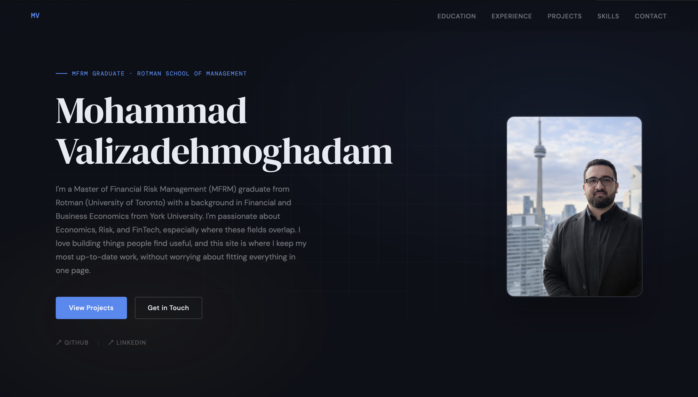

# Personal Website

Live at: [thismv.github.io/Personal_Website.github.io](https://thismv.github.io/Personal_Website.github.io)

My personal corner of the internet — a portfolio, a resume, and a place to share my work without the constraints of a single page. Built with HTML, CSS, and JavaScript, hosted on GitHub Pages.

First time building a website. AI (Claude & GPT) was involved throughout the process — from design to code to iteration. I use AI wherever it helps me build and understand things faster, and I'm not shy about it.

## Sections
- **Hero** — intro and links
- **Education** — academic background and certifications
- **Experience** — professional timeline
- **Projects** — selected analytical work
- **Skills** — technical toolkit
- **Contact** — reach out

## Files
- `index.html` — page structure and content
- `style.css` — all styling
- `headshot.png` — profile photo
- `preview.png` — site screenshot (for this README)

## Built With
- HTML, CSS, Vanilla JavaScript
- Fonts: Cormorant Garamond, DM Sans, DM Mono (Google Fonts)
- Hosted on GitHub Pages
- Designed with AI assistance (Claude by Anthropic & ChatGPT by OpenAI)